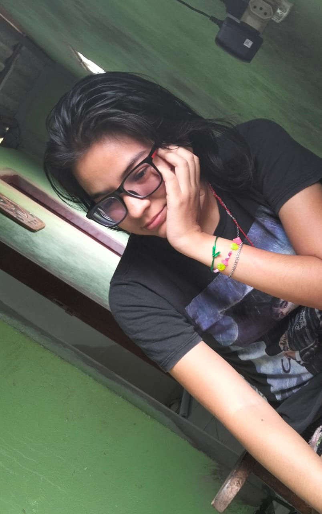

## Hi there 👋

<!-- Banner (opcional). Use sua imagem local ou remova este bloco -->

  

<h1 align="center">Olá, eu sou Jessica Maria 🐦‍⬛</h1>

  <em>Freelancer • Desenvolvimento Web • Modelagem 3D</em>

  

---

## Sobre mim

Sou freelancer e trabalho com modelagem 3D, inclusive modelagem em blocos. 
Gosto de unir criatividade em modelagem 3D com soluções objetivas, sempre com uma comunicação clara e colaboração ativa. Estou construindo meu portfólio — aberto a desafios reais e parcerias.

- 🌱 Atualmente aprendendo: boas práticas de arquitetura front-end  
- 💼 Atuação: freelancer em desenvolvimento web e modelagem 3D (incluindo modelagem em blocos)  
- 🎯 Objetivo: entregar soluções web seguras, rápidas e fáceis de manter  
- 💬 Soft skills: comunicação, liderança, trabalho em equipe  
- 🐧 Extra: experiência em dar aula  

---

## Tecnologias

- Linguagens e Front-end:
  - HTML • CSS • JavaScript
- Back-end e Dados:
  - Python

  
  
  
  

---

## Serviços

- Criação de páginas webs
- Integração de formulários e envio de e-mails
- Compilação de arquivos CSS e JavaScript
- Otimização de imagens

  <em>Estou aberto a novos projetos e parcerias!</em>

---

## Projetos

Estou organizando meu primeiro repositório de designer público. Em breve, você encontrará:

- Template do site pessoal
- Portfólio pessoal
- Scripts úteis em Python

---

## Estatísticas e métricas

  
  

  

---

## Contato

  <a href="mailto:jessicamarianunes59@gmail.com"><b>Vamos conversar?</b></a>

---

  Contador de visitas 
  

<!--
Como usar:
1) Crie um repositório com o MESMO nome do seu usuário (AssassinoShinigami1987/AssassinoShinigami1987).
2) Salve este arquivo como README.md.
3) Confirme seu e-mail (acima usei josepaulo20030502@gmail.com) e ajuste se necessário.
4) Banner mantido usando assets/images/perfil.jpeg.
5) Atualize a seção "Projetos" assim que publicar algo novo.
-->

